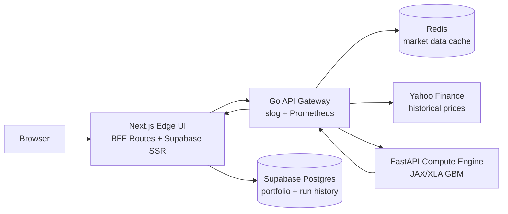

# Quant Stress Engine

Three-tier portfolio stress-testing application:

- `compute-engine/`: FastAPI service with JAX/XLA fixed-shape Monte Carlo simulation
- `api-gateway/`: Go gateway for market data, analytics orchestration, Redis-backed caching, metrics, and compute proxying
- `edge-ui/`: Next.js frontend for auth, portfolio selection, analytics visualization, and run history
- `supabase/`: PostgreSQL migrations for saved portfolios and stress-run telemetry

## System Architecture



The compute tier simulates `100000` portfolio paths using padded vectors of length `50` and covariance matrices of shape `50 x 50`. The startup warmup compiles that static execution shape before live traffic reaches `POST /simulate`.

The gateway fetches historical prices for the supported ticker universe, aligns daily log returns, derives annualized drift and covariance, pads the fixed-shape compute payload, and enriches the response with covariance/correlation matrices plus telemetry.

## API Contract

- Compute health: `GET /health`
- Compute simulation: `POST /simulate`
- Gateway health: `GET /health`
- Gateway metrics: `GET /metrics`
- Gateway supported tickers: `GET /api/v1/supported-tickers`
- Gateway stress route: `POST /api/v1/stress-test`
- UI portfolio route: `GET|POST /api/v1/portfolio`
- UI run history route: `GET /api/v1/history`

Stress requests support:

```json
{
  "tickers": ["AAPL", "MSFT"],
  "weights": [60, 40],
  "horizon_days": 252,
  "confidence_level": 0.99,
  "risk_free_rate": 0.02,
  "seed": 42
}
```

Responses include `expected_return`, `var_95`, `var_99`, selected `value_at_risk`, `cvar`, `annualized_volatility`, `sharpe_ratio`, `histogram`, timing telemetry, `covariance_matrix`, and `correlation_matrix`.

## Local Run

```bash
docker compose up --build
```

Service defaults:

- UI: `http://localhost:3000`
- Gateway: `http://localhost:8080`
- Compute: `http://localhost:8000`
- Redis: `localhost:6379`

## Repo Commands

```bash
make test
make lint
make build
make integration
```

The integration smoke test validates compute/gateway health, runs a 20-ticker stress request twice, asserts warm-path compute latency, and optionally verifies authenticated UI history persistence when these variables are set:

```bash
UI_URL=http://localhost:3000
NEXT_PUBLIC_SUPABASE_URL=...
NEXT_PUBLIC_SUPABASE_PUBLISHABLE_KEY=...
SUPABASE_TEST_EMAIL=...
SUPABASE_TEST_PASSWORD=...
REQUIRE_AUTH_FLOW=1
```

## Observability

The gateway writes structured JSON logs with `compute_ms`, `data_fetch_ms`, and `total_roundtrip_ms` for every stress test. Prometheus metrics are exposed at `/metrics`, including HTTP request counts/durations and stress-test data-fetch, compute, and total round-trip histograms.

## Render Deploy

The repository includes [render.yaml](/mnt/slurm_nfs/a6abdulm/projects/quant-stress-engine/render.yaml:1) with private compute/gateway services, Redis, and the public UI service. The UI proxies server-side to the gateway, so browsers do not need direct gateway access.

## Supabase Setup

1. Create a Supabase project.
2. Apply every SQL migration under [supabase/migrations](/mnt/slurm_nfs/a6abdulm/projects/quant-stress-engine/supabase/migrations).
3. Set these UI environment variables:
   - `NEXT_PUBLIC_SUPABASE_URL`
   - `NEXT_PUBLIC_SUPABASE_PUBLISHABLE_KEY`
4. Enable email/password auth in Supabase Auth.
5. Add your deployed UI origin to the Supabase redirect URL allowlist, including `/auth/callback`.

Without Supabase variables, the UI runs in guest mode and the stress engine remains available.
