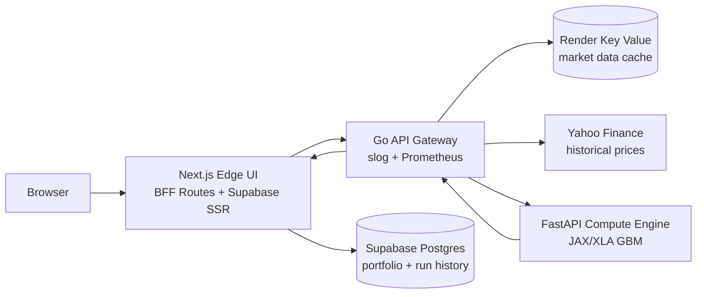

# Quant Stress Engine

Quant Stress Engine is a production-oriented portfolio risk platform built around a fixed-shape Monte Carlo execution contract. It combines a FastAPI/JAX compute worker, a concurrent Go market-data gateway, a Next.js BFF and operator UI, Render Key Value price caching, and optional Supabase persistence for portfolios and run history.

## Why This Project Matters

Institutional risk systems are judged by how well they coordinate data freshness, execution determinism, and operator ergonomics under load. This project demonstrates those concerns in a compact open-source architecture:

- A Go gateway coordinates concurrent historical data pulls, cache reuse, rate-limit fallback, annualized moment construction, scenario shocks, and compute proxying.
- The compute engine keeps tensor shapes static at `50` assets, `100000` Monte Carlo paths, and `50` histogram bins so JAX/XLA compiles the exact production path during startup.
- The Next.js BFF keeps service wiring out of browser code, supports Supabase cookie authentication, and still runs the core stress workflow in guest mode when Supabase is absent.
- The UI exposes operator-grade risk outputs: VaR, CVaR, Sharpe ratio, annualized volatility, covariance/correlation matrices, scenario stress, per-asset volatility contribution, and structured JSON export.

## System Topology



| Tier | Path | Runtime | Responsibility |
| --- | --- | --- | --- |
| Compute | `compute-engine/` | FastAPI, JAX, XLA | Validates the fixed padded payload, runs the GBM Monte Carlo kernel, returns risk metrics and exactly `50` histogram bins. |
| Gateway | `api-gateway/` | Go | Fetches and caches market data, derives annualized `mu` and `Sigma`, applies scenario shocks, pads the compute payload, computes risk attribution, and exposes Prometheus metrics. |
| UI and BFF | `edge-ui/` | Next.js App Router, TypeScript, Tailwind | Discovers gateway capabilities, manages portfolios, proxies gateway calls server-side, handles optional Supabase SSR auth, renders analytics, and exports runs. |
| Persistence | `supabase/` | Postgres, RLS | Stores saved portfolios, authenticated run history, scenario metadata, and risk attribution JSON. |
| Cache | Render Key Value or local Redis-compatible cache | Redis-compatible protocol | Shares historical price series across gateway instances with in-memory fallback when no cache URL is configured. |

## Execution Contract

| Field | Contract |
| --- | --- |
| Asset vector length | `50` padded weights and `50` padded annualized drift values |
| Covariance shape | `50 x 50` padded annualized covariance matrix |
| Monte Carlo paths | `100000` |
| Histogram bins | `50` |
| Live portfolio selection | Up to `20` requested tickers |
| Supported universe | `22` gateway-discovered symbols |
| Compile behavior | Compute service prewarms the exact fixed-shape JAX path on startup |

The gateway may enrich the request with scenario shocks and risk attribution, but it does not alter the compute shape. Scenario scaling is applied to selected drift and covariance values before padding.

## API Surface

| Service | Method | Endpoint | Purpose |
| --- | --- | --- | --- |
| Compute | `GET` | `/health` | Compute readiness probe. |
| Compute | `POST` | `/simulate` | Fixed-shape JAX simulation. Accepts padded `weights`, `mu`, `covariance`, path count, horizon, confidence, risk-free rate, and seed. |
| Gateway | `GET` | `/health` | Gateway readiness probe. |
| Gateway | `GET` | `/metrics` | Prometheus counters and histograms for HTTP, data-fetch, compute, and round-trip timing. |
| Gateway | `GET` | `/api/v1/supported-tickers` | Returns provider metadata, cache TTL, max selection count, padded asset count, ticker universe, and supported macro scenarios. |
| Gateway | `POST` | `/api/v1/stress-test` | Runs market-data enrichment, scenario scaling, JAX simulation, risk attribution, and matrix response assembly. |
| UI BFF | `GET` | `/api/v1/supported-tickers` | Server-side proxy to the gateway. |
| UI BFF | `POST` | `/api/v1/stress-test` | Server-side proxy to the gateway plus optional authenticated persistence. |
| UI BFF | `GET|POST` | `/api/v1/portfolio` | Authenticated saved portfolio read/write when Supabase is configured. |
| UI BFF | `GET` | `/api/v1/history` | Authenticated recent stress-run history. |

Example gateway request:

```json
{
  "tickers": ["AAPL", "MSFT"],
  "weights": [60, 40],
  "horizon_days": 252,
  "confidence_level": 0.99,
  "risk_free_rate": 0.02,
  "seed": 42,
  "scenario_id": "financial_crisis_2008"
}
```

Gateway responses include `expected_return`, `var_95`, `var_99`, selected `value_at_risk`, `cvar`, `annualized_volatility`, `sharpe_ratio`, `histogram`, `scenario`, `risk_contributions`, timing telemetry, `mu`, `covariance_matrix`, and `correlation_matrix`.

## Environment Variables

| Scope | Variable | Default | Required | Description |
| --- | --- | --- | --- | --- |
| Compute | `PORT` | `8000` | No | Uvicorn listen port. |
| Gateway | `PORT` | `8080` | No | Gateway listen port when `API_GATEWAY_ADDR` is not set. |
| Gateway | `API_GATEWAY_ADDR` | `:8080` | No | Explicit Go listen address. |
| Gateway | `COMPUTE_ENGINE_URL` | `http://localhost:8000` | Yes in deployment | Internal compute service URL or Render hostport. |
| Gateway | `REQUEST_TIMEOUT` | `30s` | No | HTTP server and upstream request timeout. |
| Gateway | `MARKET_DATA_BASE_URL` | `https://query1.finance.yahoo.com` | No | Yahoo Finance chart API base URL. |
| Gateway | `MARKET_DATA_RANGE` | `3y` | No | Historical lookback range. |
| Gateway | `MARKET_DATA_CACHE_TTL` | `6h` | No | Freshness window for Redis or in-memory market data. |
| Gateway | `MARKET_DATA_FETCH_WORKERS` | `2` | No | Concurrent fetch worker count. |
| Gateway | `MARKET_DATA_FETCH_MIN_WAIT` | `120ms` | No | Lower jitter bound between cold market-data requests. |
| Gateway | `MARKET_DATA_FETCH_MAX_WAIT` | `320ms` | No | Upper jitter bound between cold market-data requests. |
| Gateway | `REDIS_URL` | empty | No | Redis-compatible Render Key Value connection string; gateway falls back to in-memory cache if absent. |
| UI | `PORT` | `3000` | No | Next.js standalone server port. |
| UI | `API_GATEWAY_INTERNAL_URL` | `http://localhost:8080` | Yes in deployment | Gateway endpoint used by BFF routes. |
| UI | `NEXT_PUBLIC_SUPABASE_URL` | empty | No | Enables Supabase auth and persistence when paired with a publishable key. |
| UI | `NEXT_PUBLIC_SUPABASE_PUBLISHABLE_KEY` | empty | No | Supabase browser and SSR publishable key. |

## Performance Benchmarks

Benchmarks are from [BENCHMARK.md](BENCHMARK.md) on a local Linux CPU environment with market data warmed and the compute, gateway, and Next.js standalone server running locally.

| Profile | Payload | Result |
| --- | --- | --- |
| Smoke warm path | `20` tickers, `100000` paths, `252` day horizon, `0.99` confidence | Warm HTTP `128.59 ms`, compute `112.84 ms`, data fetch `10.31 ms`, total gateway round trip `127.45 ms`. |
| Stable local load | `wrk -t2 -c4 -d20s --timeout 10s --latency` | `10.12 req/s`, average `390.93 ms`, p99 `476.46 ms`, max `495.06 ms`, zero errors. |
| Python p95/p99 harness | `120` requests, `4` workers, warmed 20-ticker payload | `10.06 req/s`, p50 `391.58 ms`, p95 `470.28 ms`, p99 `570.07 ms`, zero errors. |
| CPU saturation note | `wrk -t4 -c16 -d20s` | Throughput stayed near `10.16 req/s`; p99 reached `1.98 s` and the client reported timeout pressure with a `2 s` timeout. |

## Production Verification

The latest public Render benchmark was captured on 2026-05-23 through the deployed gateway with the live 20-ticker, `100000` path, `252` day, `0.99` confidence payload. A forced cold start was not available without Render admin credentials, so the first row is labeled as the current first request rather than a true idle cold start.

| Profile | Client RTT | Gateway processing | Market data fetch | JAX compute |
| --- | ---: | ---: | ---: | ---: |
| Current first request | `670.57 ms` | `439.47 ms` | `82.07 ms` | `116.10 ms` |
| Warm p50, 10 requests | `498.98 ms` | `360.99 ms` | `99.03 ms` | `234.19 ms` |
| Warm p95 estimate, 10 requests | `617.92 ms` | `492.36 ms` | `201.42 ms` | `246.36 ms` |
| Warm p99 estimate, 10 requests | `630.06 ms` | `503.81 ms` | `201.76 ms` | `247.45 ms` |

The public guest-mode smoke check confirmed `50` histogram bins, `20` requested tickers, `20` risk-contribution rows, scenario metadata, covariance output, and sub-second warm JAX execution on the full `50`-asset padded contract. Authenticated Supabase verification requires rotated runtime credentials and should be run before claiming identity-provider readiness.

## Local Development

```bash
docker compose up --build
```

| Service | URL |
| --- | --- |
| UI | `http://localhost:3000` |
| Gateway | `http://localhost:8080` |
| Compute | `http://localhost:8000` |
| Redis | `localhost:6379` |

Repository commands:

```bash
make test
make lint
make build
make integration
```

The integration smoke test validates compute and gateway health, runs a 20-ticker stress request twice, checks warm-path latency, and optionally validates authenticated UI history persistence:

```bash
UI_URL=http://localhost:3000 \
NEXT_PUBLIC_SUPABASE_URL=... \
NEXT_PUBLIC_SUPABASE_PUBLISHABLE_KEY=... \
SUPABASE_TEST_EMAIL=... \
SUPABASE_TEST_PASSWORD=... \
REQUIRE_AUTH_FLOW=1 \
python scripts/integration_smoke.py
```

## Deployment

[render.yaml](render.yaml) is the deployment source of truth. It defines:

| Render resource | Current public endpoint | Runtime | Notes |
| --- | --- | --- | --- |
| `quant-stress-ui` | `https://quant-stress-ui.onrender.com` | Docker, Next.js standalone server | Browser entry point and BFF. It proxies gateway calls server-side. |
| `quant-stress-gateway` | `https://quant-stress-gateway.onrender.com` | Docker, Go static binary | Market-data orchestration, Render Key Value cache integration, compute proxy, and Prometheus metrics. |
| `quant-stress-compute` | `https://quant-stress-compute.onrender.com` | Docker, FastAPI/JAX | Fixed-shape simulation worker with startup warmup. |
| `quant-stress-redis` | Internal Render Key Value endpoint | Render Key Value | Shared historical price-series cache. |

The UI is intentionally deployed as a Node server rather than a static export so BFF routes, gateway proxying, and Supabase cookie authentication run natively.

## Supabase Setup

1. Create a Supabase project.
2. Apply every SQL migration under [supabase/migrations](supabase/migrations) in filename order.
3. Set `NEXT_PUBLIC_SUPABASE_URL` and `NEXT_PUBLIC_SUPABASE_PUBLISHABLE_KEY` on the UI service.
4. Enable email/password auth in Supabase Auth.
5. Add the deployed UI origin and `/auth/callback` to the Supabase redirect URL allowlist.

Without Supabase variables, the UI runs in guest mode and the stress engine remains available.

## Observability

The gateway emits structured JSON logs with `ticker_count`, `confidence_level`, `horizon_days`, `compute_ms`, `data_fetch_ms`, and `total_roundtrip_ms` for stress requests. Prometheus metrics are exposed at `/metrics` for request counts, request duration, market-data enrichment duration, compute duration, and total gateway round-trip duration.
